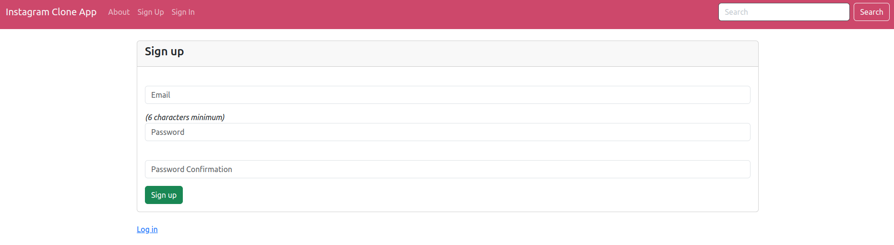
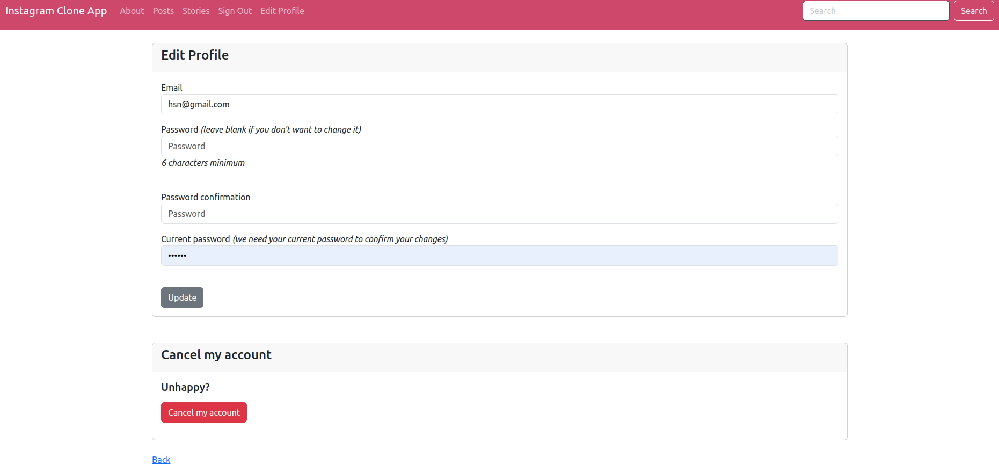
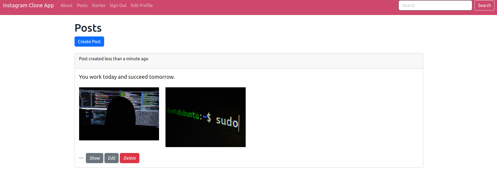
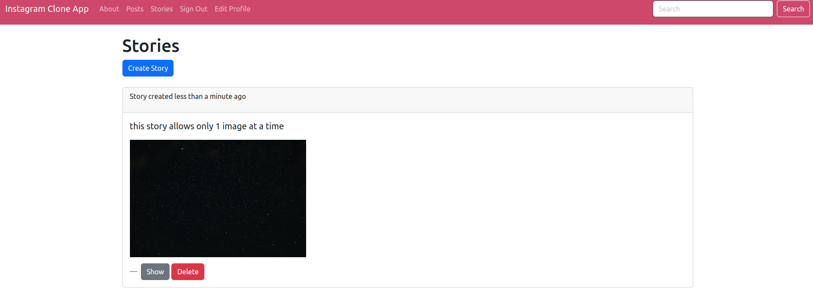

Basic Rails Web Application for Instagram Clone which connects multiple Users.

---
## Intallation

- OS: Ubuntu 20.04 (Linux)
- Follow this [link](https://gist.github.com/ziaulrehman40/16445c56e3f7bc7d1dece245fb61cf8e) to set up Ruby (2.7.6) and Rails (major 5.2), including their related components.

> No need to install postgres as sqlite is used for this app which is preinstalled on Ubuntu.

- After everything is set:
1. Enter this on your terminal:

```bash
rails server
```

2. Search `localhost:3000` on your browser to access the application.

---
## Functionalities

1. Signup, Login, and Account Editing/Cancellation (`Devise` Gem).



2. Upload Posts and/or Stories



---
## Pending Functionalities
3. Add Comments and/or Likes.
4. Follow each other.
5. Private/Public Account.
